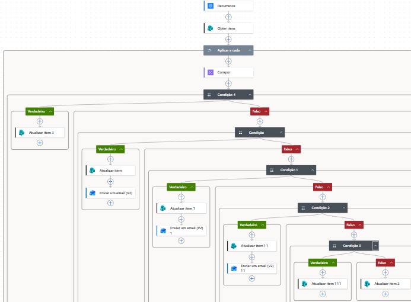

# Construção do Fluxo

## Etapa 1 - Criação da Base de Contratos

Foi criada uma lista no SharePoint para armazenar as informações dos contratos.

Campos utilizados:

- Número do Contrato
- Fornecedor
- Gerência
- Gestor
- Data de Início
- Data de Vencimento
- Status EasyDrive
- StatusVencimento

## Etapa 2 - Criação do Fluxo no Power Automate

Foi criado um fluxo automatizado com execução diária para verificar contratos próximos ao vencimento.

## Etapa 3 - Consulta dos Contratos

Foi utilizada a ação **Get Items** para recuperar os contratos cadastrados na lista SharePoint.

## Etapa 4 - Implementação da Regra de Negócio

Foi criada uma condição para identificar contratos com vencimento em até 30 dias.
Mas para melhor comunicação a gestão solicitou que os avisos fossem dados em 90, 60 e 30 dias antes da data de vencimento.

## Etapa 5 - Envio das Notificações

Após validar os contratos, o fluxo envia automaticamente um e-mail ao responsável.

O e-mail contém:

## Etapa 6 - Resultado Final

O processo passou a ser executado automaticamente, reduzindo o acompanhamento manual e aumentando o controle dos vencimentos contratuais.

